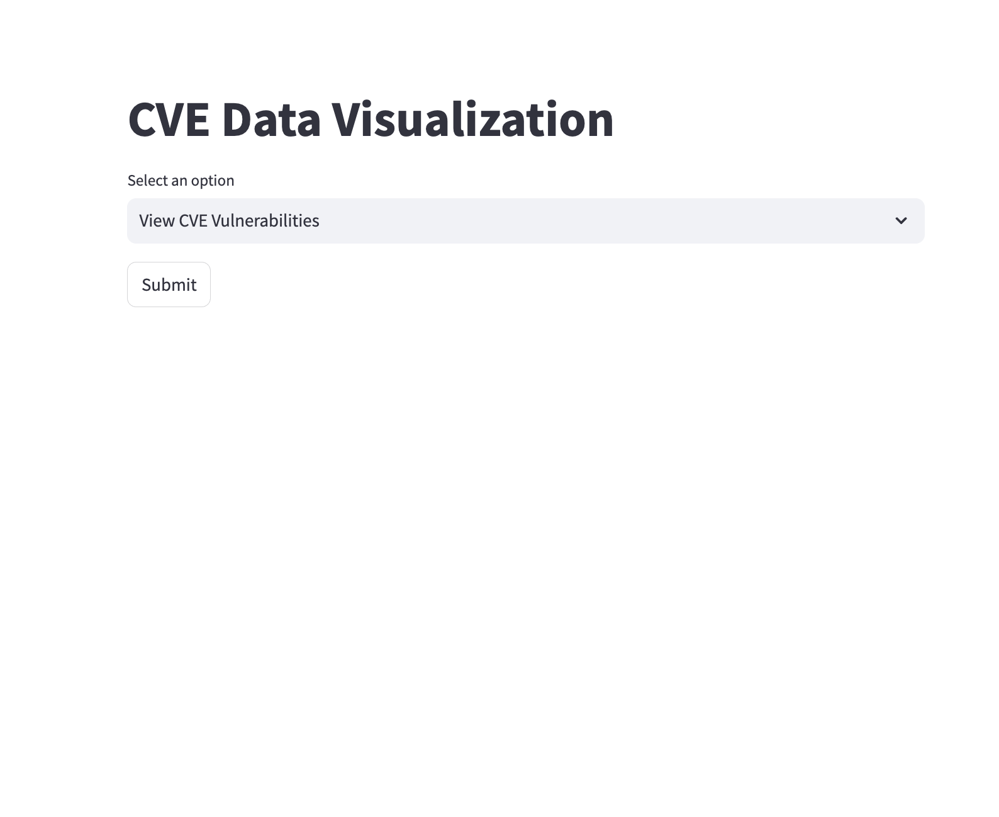

# CyberSecurity Vulnerability Check - A Streamlit showcase

Simple Streamlit application leveraging public known API for Vulnerabilities

# CVE Data Visualization

This Streamlit app visualizes CVE vulnerabilities using data fetched from the NVD API.

"https://services.nvd.nist.gov/rest/json/cves/2.0"

## Features
- Fetches and displays CVE data from the NVD API.
- Visualizes the count of CVEs by severity using a bar chart.
- Custom colors for different severity levels (green for LOW, yellow for MEDIUM, red for HIGH, purple for CRITICAL).

## Installation

1. Clone the repository:
    ```
    git clone https://github.com/yourusername/cve_data_visualization.git
    
    cd cve_data_visualization
    
    ```

2. Install the required packages:
    ```
    pip install -r requirements.txt
    
    ```

3. Run the app:
    ```

    streamlit run app.py
    
    ```

## Usage

1. Run the app using the command `streamlit run app.py`.
   
2. Select "View CVE Vulnerabilities" from the dropdown menu.
   
3. Click the "Submit" button to fetch and visualize the CVE data.

## Results



